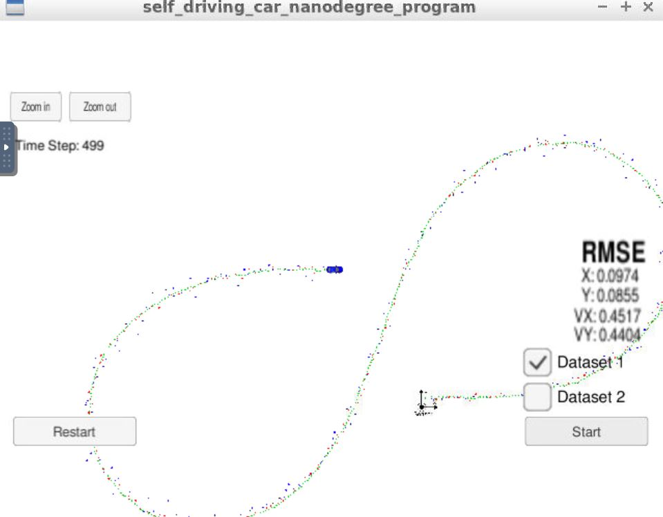
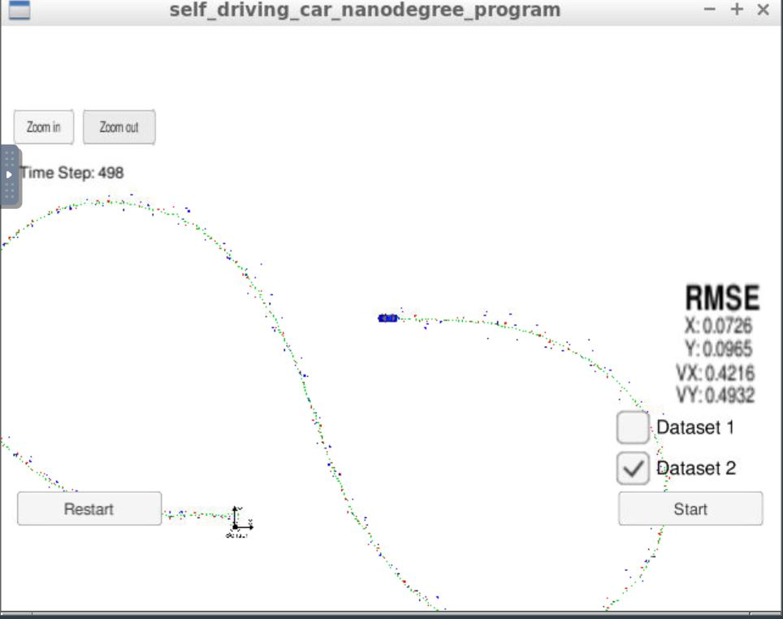

# Extended Kalman Filter Project 
Self-Driving Car Engineer Nanodegree Program

The goals and steps of this project are as follows :
* Compilation : The code should compile without errors
* Accuracy :  The code should accurately predict results such that px, py, vx, and vy RMSE should be less than or equal to the values [.11, .11, 0.52, 0.52].
* Algorithm process : General processing flow should be followed, Handles the first measruement correctly,Algorithm first predicts and then updates ,Kakman filter handles both Lidar and Radar data
* Code efficieny : Code should be efficinet and redudant code should not be present

## Compilation and Accuracy

The code was compiled without errors in the project workspace. The execution was done using simulator for both data sets - dataset1 and dataset2. The RMSE values were below the target range.

  

## Algorithm Process

The code changes were done in the below files :
* FusionEKF.cpp 
* kalman_filter.cpp
* tools.cpp

## Code Efficiency

